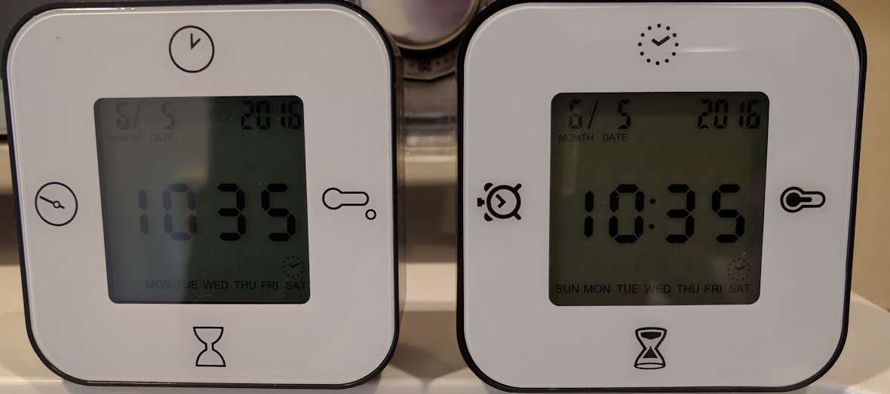

# timeto 

 
 

`timeto` is a simple command-line tool for timezone and time difference calculations. 

 

## Getting Started 

```sh 
go install github.com/kazsk1/timeto@main 
``` 

## Usage

  1. Convert UNIX Timestamp to UTC
     ```sh 
     timeto [UNIX timestamp]
     ``` 

     > Supported Formats:
     > 
     > • seconds (10 digits), milliseconds (13 digits), microseconds (16 digits), and nanoseconds (19 digits).

  2. Convert RFC3339 to Target Timezone

     ```sh 
     timeto [YYYY-MM-DDTHH:MM:SSZ] [Target TZ]
     ``` 

  3. Convert Date & Time to UTC

     ```sh 
     timeto [Date] [Time] [Source TZ]
     ``` 

  4. Convert Date & Time to Target Timezone

     ```sh 
     timeto [Date] [Time] [Source TZ] [Target TZ]
     ``` 

     > Supported Formats:
     > 
     > • Date: YYYY-MM-DD or YYYY/MM/DD (output preserves your input separator)
     > 
     > • Time: HH:MM:SS or HH:MM
     > 
     > • Timezones: UTC offsets (UTC-12 to UTC+14) or abbreviations (JST, PST, EST, UTC, CEST, etc.)


## Examples

  1. UNIX Timestamp to UTC

     ```sh 
     timeto 1718000000123
     ``` 

     > Conversion
     >   UNIX time: 1718000000123
     >     UTC time: 2024-06-10 06:13:20.123 UTC

  2. RFC3339 (UTC) to JST

     ```sh 
     timeto 2023-04-22T09:49:59Z JST
     ``` 

     > Conversion
     >   Original time: 2023/04/22 09:49:59 UTC
     >     Target time: 2023/04/22 18:49:59 JST

  3. Source Time to UTC

     ```sh 
     timeto 2023/04/10 09:00 UTC+9
     ``` 

     > Conversion
     >   Original time: 2023/04/10 09:00 UTC+9
     >       UTC time: 2023/04/10 00:00 UTC

  4. UTC Offset Conversion

     ```sh 
     timeto 2023/04/21 12:59:59 UTC-7 UTC+9
     ``` 

     > Conversion
     >   Original time: 2023/04/21 12:59:59 UTC-7
     >     Target time: 2023/04/22 04:59:59 UTC+9

  5. Timezone Abbreviation Conversion

     ```sh 
     timeto 2023-04-21 15:49:42 PDT NZST
     ``` 

     > Conversion
     >   Original time: 2023-04-21 15:49:42 PDT
     >     Target time: 2023-04-22 10:49:42 NZST
  
## Supported Timezone Abbreviations

  AEDT, AEST, AKDT, AKST, AWDT, AWST, CAT, CDT, CEST, CET, CST, EAT, EDT, EEST, EET, EST, HDT, HKT, HST, JST, KST, MDT, MSD, MSK, MST, NZDT, NZST, PDT, PST, SGT, WEST, WET, UTC

## License

This project is licensed under the MIT License. See the [LICENSE](LICENSE) file for details.
 
